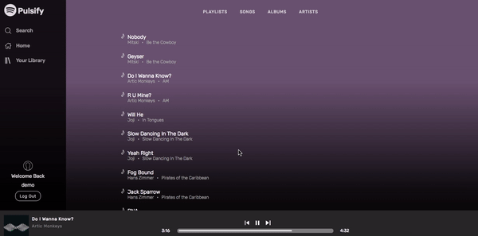
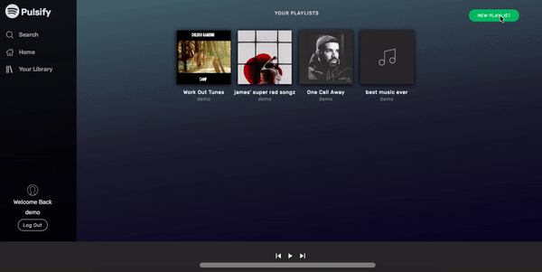
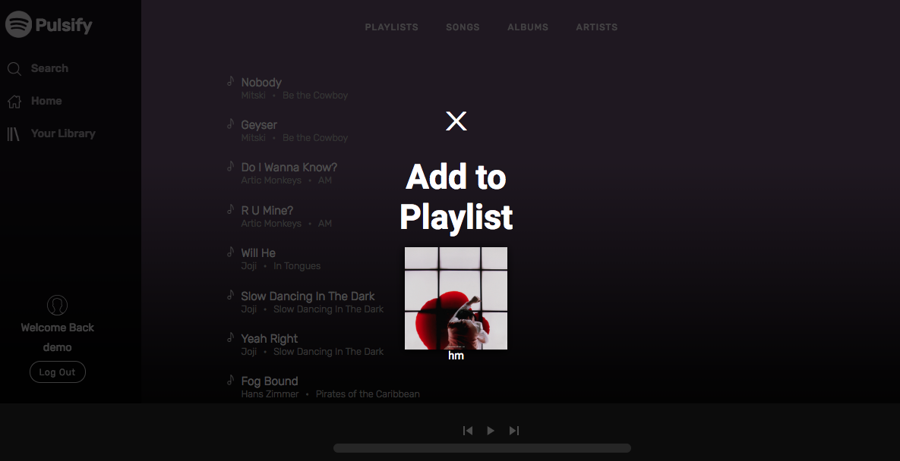

# Pulsify README

[Pulsify](https://pulsify-app.herokuapp.com/) was inspired by Spotify, a music streaming service with over 180 million users. Similarly to Spotify, Pulsify features continuous playback, artist profiles, and playlist creation, all culminating in a seamless user experience.


## Technologies Used
* Pulsify was created with Rails on the backend using a PostgreSQL database and React/Redux on the frontend.
* Images and MP3s were stored using AWS S3, lightening the local storage load increasing scalability.
* The loading time of the app was also optimized through jBuilder and Rails' Active Storage which made for a more cohesive experience for the user.

## Key Features

### `Audio Player`


#### Continuous Play
Continuous play is an integral part of the streaming experience. Pulsify provides continuous play, allowing users to navigate to other pages in the application without disturbing their listening experience.

#### Progress Bar
The dynamic progress bar allows the user to play, pause, and skip a song. To more easily sync the progress bar with the audio player itself, I had to create a reference to both using React createRef.

I had to account for the case when a user would want to move ahead or backwards in the song via the progress bar. In order to do that, I calculated the percent change of the progress bar as a whole while taking into account the click location of the user.

``` javascript
progressBarUpdate(e){
  let progressBar = this.progressBar.current;
  let player = this.playerRef.current;
  if (this.props.song){
    let progress =
      ((e.clientX - progressBar.offsetParent.offsetLeft) / progressBar.clientWidth) * 100;
    this.setState({progress: progress});
    player.currentTime = player.duration * (progress / 100);
  }
}
```

#### Queue
A queue was implemented so that once a song ends, the next song will play seamlessly. The contents of the queue differ based on which page the user chose to play the song. If a user began playing a song on the album show page, the queue will be populated with songs from that album. The queue also allows users to skip songs and listen to a previous song.

### `Playlist CRUD`

#### Playlist Creation/Update/Delete


Signed in users are given the ability to create and customize playlists. Once created, the name of the playlist can be updated on the show page. Also on the show page, is the ability to delete a playlist as well as the play button which will play the first song on the playlist.

All playlists are displayed on the Home/Landing page of the website, which you can use to explore what your friends and other Pulsify users have been listening to.

#### Playlist Songs

What good is a playlist without any songs? Users have the ability to add a song to any of their playlists on almost any page. In order to facilitate the addition of songs, custom routes were added.


``` ruby
delete '/playlist_songs/:playlist_id/:song_id', to: 'playlists#destroy_playlist_song'
post '/playlist_songs', to: 'playlists#add_playlist_song'
```
The playlist cover is also set to be the album cover of the first song of the playlist.

### `Search`

## Future Plans
* Implement ability for users to upload profile pictures
* Infinite scrolling on the index pages
* Ability to interact with friends
